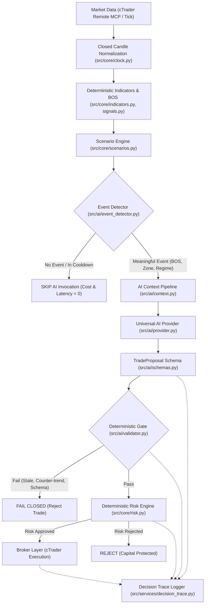

# AI Architecture & Pipeline Specification
**Version**: 1.0.0 (Phase C, D, I, Q Standard)  
**Status**: APPROVED & FROZEN

---

## 1. Architectural Philosophy: Deterministic Core with Analytical AI

In accordance with strict production reliability requirements:
* **NO Multi-Agent LLM Swarms**: The system firmly rejects complex, non-deterministic loops (e.g. CEO + 7 LLM sub-agents).
* **Deterministic Single Source of Truth**: All indicators (RSI, EMA, ATR), structure detection (BOS $N=20$, Pinbar, Engulfing), risk sizing, and position tracking are implemented in pure, audited Python.
* **AI Output is a Proposal**: The AI generates a `TradeProposal` (a structured hypothesis). It has **zero direct access** to broker order placement functions.
* **Deterministic Gatekeeper**: Every AI proposal must clear an independent, un-overrideable validation gate before reaching the Risk Engine.

---

## 2. End-to-End Execution Pipeline

---

## 3. Component Responsibility Matrix

| Component | Responsibility | Authority Level |
| :--- | :--- | :--- |
| **`src/core/indicators.py`** | Wilder RSI, EMA, ATR math | **Deterministic / Authoritative** |
| **`src/core/signals.py`** | BOS $N=20$, Candlestick pattern detection | **Deterministic / Authoritative** |
| **`src/core/scenarios.py`** | Scenario tracking & activation lifecycle | **Deterministic State Machine** |
| **`src/ai/event_detector.py`** | Filter triggers to prevent per-tick API churn | **Invocation Gate** |
| **`src/ai/context.py`** | Compile indicators & risk into normalized JSON | **Data Transformation** |
| **`src/ai/provider.py`** | Generate `TradeProposal` via LLM or offline rules | **Advisory Only (No Execution)** |
| **`src/ai/validator.py`** | Validate freshness, confidence, trend alignment | **Hard Gatekeeper (Fail-Closed)** |
| **`src/core/risk.py`** | Enforce daily loss, lot sizing, kill switch | **Authoritative Risk Guardian** |
| **`src/brokers/`** | Submit orders to cTrader Demo/Live | **Execution Handler** |

---

## 4. Fallback & Offline Mode
When the live AI provider returns HTTP 429 (quota exhausted) or network errors:
1. Live entries dependent on AI are immediately halted (**Fail-Closed**).
2. Existing open positions continue to be monitored and managed by the deterministic Risk Engine (trailing ATR stops, break-even).
3. Backtests utilize `OfflineDeterministicAIProvider` or pre-recorded decision traces to ensure $100\%$ reproducible, zero-cost historical simulations.
