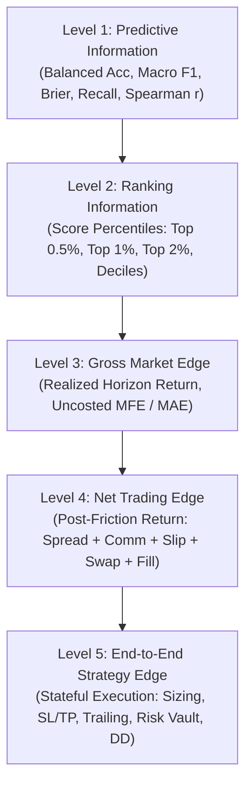

# GATE 22R — QUANTITATIVE EDGE TAXONOMY & TAIL INTERPRETATION STANDARD
**Authority:** Institutional Quantitative Systems Audit & Software Quality Engineering  
**Version:** 1.0.0-Institutional  
**Governing Gate:** GATE 22R  

---

## 1. The 5-Level Quantitative Edge Hierarchy

To prevent erroneous claims of profitability based solely on statistical associations or score orderings, all quantitative claims must be strictly classified into the following 5-level hierarchy:

### Level 1: Predictive Information
- **Definition:** Statistical capacity of model outputs to predict discrete target classes or continuous target values beyond chance.
- **Metrics:** Balanced accuracy, macro F1 score, class recall/precision, multi-class Brier score, calibration curve slope/intercept, Spearman rank correlation.
- **Constraint:** A model with statistically significant predictive information may still generate negative returns due to asymmetric payoff distribution or transaction friction.

### Level 2: Ranking Information
- **Definition:** Capacity of calibrated probability scores or decision values to monotonically order market opportunities.
- **Metrics:** Percentile buckets (Top 0.5%, Top 1.0%, Top 2.0%, Top 5.0%), decile/quintile sorting, score-to-quantile spread.
- **Constraint:** High ranking resolution does not guarantee that the absolute return of top ranks exceeds the cost hurdle.

### Level 3: Gross Market Edge
- **Definition:** The expected theoretical return over a fixed horizon $H$ before deduction of any transaction or market friction.
- **Metrics:** Uncosted future return ($R_{t, t+H}$), Maximum Favorable Excursion (MFE), Maximum Adverse Excursion (MAE).
- **Formula:** $R_{\text{gross}} = \frac{P_{t+H} - P_t}{P_t}$.

### Level 4: Net Trading Edge
- **Definition:** The expected market return per trade after deducting all deterministic and stochastic market access costs.
- **Components:**
  - Bid-ask spread ($S_{\text{pips}}$)
  - Exchange/broker commission ($C_{\text{lot}}$)
  - Execution slippage ($\delta_{\text{slip}}$)
  - Overnight financing / rollover swap ($S_{\text{points}}$)
  - Latency impact and fill rejection assumptions
- **Hurdle:** For EUR/USD M15, the baseline institutional friction is **1.82 bps** ($1.2\text{p spread} + 0.6\text{p comm} + 0.2\text{p slip}$). Any gross move $< 1.82\text{ bps}$ has a negative net trading edge.

### Level 5: End-to-End Strategy Edge
- **Definition:** The realized portfolio equity curve produced by an autonomous execution engine interacting with dynamic market states.
- **Components:**
  - Exact entry timing and bar-open fill simulation
  - Position sizing and account leverage rules
  - Hard Stop-Loss (SL) and Take-Profit (TP) path dependence
  - Daily/weekly loss kill-switches and Capital Impairment Guards
  - Maximum open positions and concurrency vetoes
  - Currency exposure concentration limits
  - Drawdown duration, recovery factor, and Calmar ratio
- **Governance Mandate:**  
  $$\mathbf{Level\ 2 \ne Level\ 5 \quad and \quad Level\ 4 \ne Level\ 5}$$  
  Under no circumstances may evidence from Level 1, 2, 3, or 4 be presented as proof of an "executable profitable strategy".

---

## 2. Formal Tail Interpretation & Vocabulary Standard

### Historical Diagnostic Tail Results (Gate 22 Diagnostic Partition)

On the historical test partition (`frxEURUSD` M15 rows `20565:24194`, 3,630 bars), model probability analysis revealed:
- **BUY Top 0.5%** ($N=18$): Gross return = $+3.54\text{ bps}$, Net return = $+1.72\text{ bps}$
- **BUY Top 1.0%** ($N=36$): Gross return = $+2.35\text{ bps}$, Net return = $+0.54\text{ bps}$
- **BUY Top 2.0%** ($N=73$): Gross return = $+2.30\text{ bps}$, Net return = $+0.48\text{ bps}$

### Mandatory Classification: `TAIL SIGNAL EVIDENCE`

Under Gate 22R governance, these findings are classified strictly as **`TAIL SIGNAL EVIDENCE`** (Level 2/Level 4 diagnostic observation).

> [!CAUTION]
> **PROHIBITED TERMINOLOGY:**  
> The following terms are **STRICTLY PROHIBITED** when describing these results:
> - ❌ `"ALPHA PROVEN"`
> - ❌ `"EDGE PROVEN"`
> - ❌ `"ROBUST ALPHA"`
> - ❌ `"PROFITABLE STRATEGY"`
> - ❌ `"READY FOR LIVE TRADING"`
> 
> **PERMITTED SCIENTIFIC TERMINOLOGY:**  
> - ✅ `"TAIL SIGNAL EVIDENCE"`
> - ✅ `"CONCENTRATED GROSS OPPORTUNITY"`
> - ✅ `"LOCALIZED SCORE ASYMMETRY"`
> - ✅ `"PREDICTIVE INFORMATION IN EXTREME PERCENTILES"`

### Scientific Rationale for Terminology Restriction
1. **Tiny Sample Size ($N=18, 36, 73$):**  
   Over 3,630 bars, 18 events represent 0.5% of samples. Standard errors are large, and statistical significance is fragile.
2. **Path Independence vs. Realistic Exits:**  
   The tail return was computed as a static 4-bar close-to-close difference ($close_{t+4} - close_t$). It does not account for intraday pathing where intra-bar volatility might trigger a 15-pip stop loss prior to the 4th bar close.
3. **Execution Semantics Barrier:**  
   When the production Decision Engine and Risk Vault were applied with confidence threshold 0.55, **zero trades were executed**. A strategy that executes zero trades has zero Level 5 strategy PnL.
4. **Absence of Independent OOS Proof:**  
   Because the dataset was exposed during research, these numbers cannot serve as unpolluted proof of out-of-sample edge.
