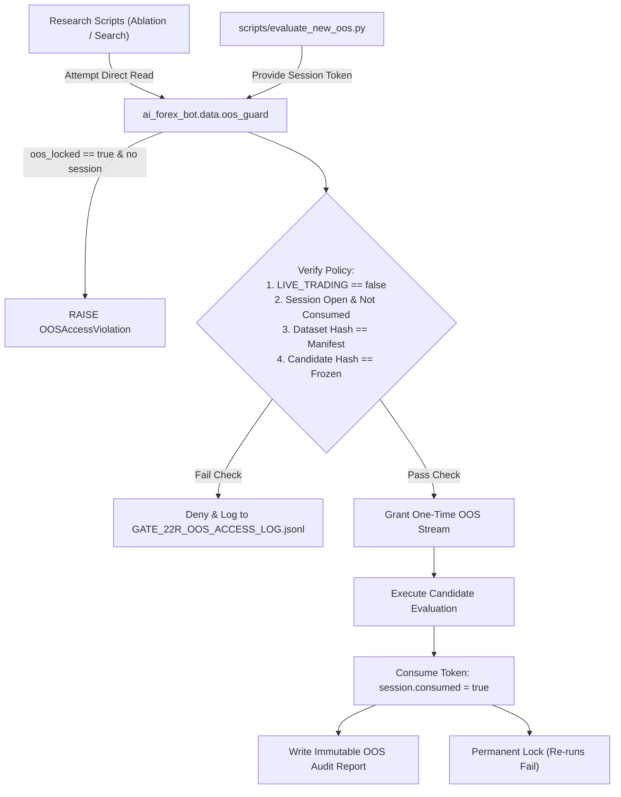

# GATE 22R — NEW OUT-OF-SAMPLE (OOS) VALIDATION PROTOCOL
**Authority:** Institutional Quantitative Systems Audit & Software Quality Engineering  
**Version:** 1.0.0-Institutional  
**Governing Gate:** GATE 22R  
**Live Trading Invariant:** `LIVE_TRADING = false`  

---

## 1. Rationale & Structural Principles

The purpose of the New OOS Validation Protocol is to restore empirical integrity after the contamination of the historical holdout partition (`2026-07-27` to `2026-09-18`). Under this protocol:

1. **Absolute Temporal Causality:**  
   New out-of-sample data (`NEW_OOS`) must strictly occur **chronologically after** the maximum ingested boundary of the clean dataset (`2026-09-18 03:15:00 UTC`).
2. **Zero Synthetic Ingestion:**  
   No synthetic candles, interpolated price series, Monte Carlo paths, or resampled data may be evaluated as an OOS holdout.
3. **Current Ingestion Status:**  
   Because all clean market parquets in the repository end at `2026-09-18 03:15:00 UTC`:
   $$\mathbf{NEW\_OOS\_STATUS = WAITING\_FOR\_REAL\_POST\_BOUNDARY\_DATA}$$
   No claims of out-of-sample edge on uncollected data are permissible.
4. **Machine-Enforced Locking:**  
   Research scripts are barred by code (`ai_forex_bot/data/oos_guard.py`) from accessing OOS data. Access is permitted strictly through a single-pass executor with an authorized, signed evaluation token.

---

## 2. Cryptographic Access-Control Architecture

---

## 3. Candidate & OOS Manifest Lifecycle

1. **Manifest Freezing:**
   - Candidate definitions (model architecture, hyperparameters, feature set, labeling rule, confidence threshold, risk parameters) are serialized into `GATE_22R_CANDIDATE_MANIFEST.json`.
   - The candidate manifest hash is cryptographically bound into `GATE_22R_OOS_MANIFEST.json`.
2. **Single-Pass Evaluation Session:**
   - A unique session ID and cryptographic token are generated.
   - The session is opened exclusively by `scripts/evaluate_new_oos.py`.
3. **Automatic Consumption:**
   - Upon execution, the dataset is verified against `OOSManifest.dataset_sha256`.
   - The evaluator runs inferences and writes results.
   - The session is marked `consumed = True` and the manifest is updated to `consumed = True`.
4. **Permanent Re-Run Invalidation:**
   - Any subsequent attempt to evaluate against the same OOS dataset or using the same session token fails immediately with `OOSAccessViolation("OOS_ALREADY_CONSUMED")`.
   - If a candidate's parameters, thresholds, or code are modified, a new candidate version must be created, and the prior OOS data cannot be reused.

---

## 4. OOS Audit Trail

Every OOS access attempt (authorized or blocked) is logged in append-only format to [`GATE_22R_OOS_ACCESS_LOG.jsonl`](file:///Users/nawaphonkoedbua/Desktop/TradingBot_Workspace/GATE_22R_OOS_ACCESS_LOG.jsonl) with timestamp, session ID, git commit, process, operation, purpose, candidate ID, allowed status, and failure reason.
